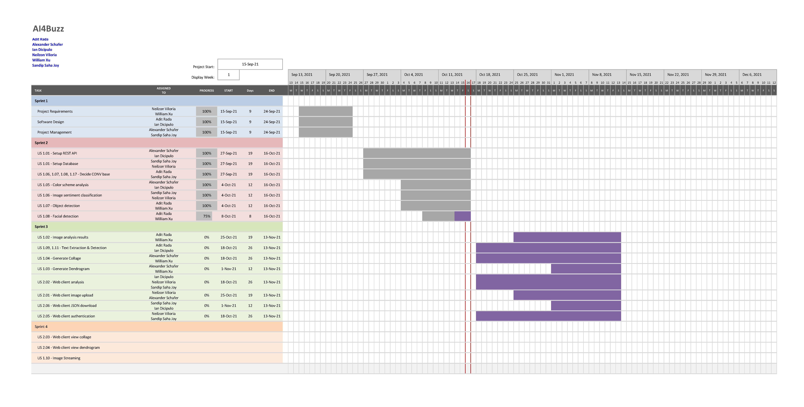
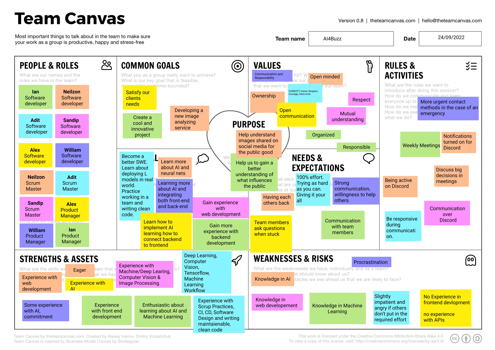

# Project Management

## Gantt Chart

## Project Plan

### Sprint 1

**Due: September 25**

| **Rubric Description** | **Task To-Do** | **Assigned To**   | **Date To Complete By** |
| ---------------------- | -------------- | ----------------- | ----------------------- |
| Software Design        | Documentation  | Adit Rada         | September 25            |
| Project Management     | Documentation  | Alexander Schafer | September 25            |
| Software Design        | Documentation  | Ian Dicipulo      | September 25            |
| Project Requirements   | Documentation  | Neilzon Viloria   | September 25            |
| Project Management     | Documentation  | Sandip Saha Joy   | September 25            |
| Project Requirements   | Documentation  | William Xu        | September 25            |

### Sprint 2

**Due: October 16**

| **Rubric Description**         | **Task To-Do**            | **Assigned To**                  | **Date To Complete By** |
| ------------------------------ | ------------------------- | -------------------------------- | ----------------------- |
| Setup REST API                 | US 1.01                   | Alexander Schafer, Ian Dicipulo  | October 16              |
| Setup Database                 | US 1.01                   | Sandip Saha Joy, Neilzon Viloria | October 16              |
| Decide CONV base               | US 1.06, 1.07, 1.08, 1.17 | Adit Rada, Sandip Saha Joy       | October 16              |
| Color Scheme analysis          | US 1.05                   | Alexander Schafer, Ian Dicipulo  | October 16              |
| Image Sentiment Classification | US 1.06                   | Sandip Saha Joy, Neilzon Viloria | October 16              |
| Object Detection               | US 1.07                   | Adit Rada, William Xu            | October 16              |
| Facial Detection               | US 1.08                   | Adit Rada, William Xu            | October 16              |

### Sprint 3

**Due: November 13**

| **Rubric Description**        | **Task To-Do** | **Assigned To**                                    | **Date To Complete By** |
| ----------------------------  | -------------- | -------------------------------------------------- | ----------------------- |
| Image Analysis Results        | US 1.02        | Adit Rada, William Xu                              | November 13             |
| Text Extraction & Detection   | US 1.09, 1.11  | Adit Rada, Ian Dicipulo                            | November 13             |
| Generate Collage              | US 1.04        | Alexander Schafer, William Xu                      | November 13             |
| Generate Dendrogram           | US 1.03        | Alexander Schafer, William Xu                      | November 13             |
| Web client analysis           | US 2.02        | Sandip Saha Joy, Neilzon Viloria, Ian Dicipulo     | November 13             |
| Web client image upload       | US 2.01        | Neilzon Viloria, Alexander Schafer                 | November 13             |
| Web client JSON               | US 2.06        | Sandip Saha Joy, Ian Dicipulo                      | November 13             |
| Web client authentication     | US 2.05        | Sandip Saha Joy, Neilzon Viloria                   | November 13             |

### Sprint 4

**Due: November 24**

| **Rubric Description**     | **Task To-Do** | **Assigned To** | **Date To Complete By** |
| -------------------------- | -------------- | --------------- | ----------------------- |
| Web client view collage    | US 2.03        |                 | November 24             |
| Web client view dendrogram | US 2.04        |                 | November 24             |
| Image Streaming            | US 1.10        |                 | November 24             |

## Team Canvas

